# portfolio-1
# Visit Sweden
The Visit Sweden webpage is for people thinking about taking a trip to Sweden, but want some more information about the country. They can find some general and fun information about the country and some useful information about a few cities. There is also a form that allows users to fill in some personal information that will get them help to plan a customized trip.

## Features
### The header
At the top of the webpage there is a header section with a logo, and a navigation/menu underneath. The menu helps the user to navigate to three different sections/pages, home(index), cities and contact-me. 
The logo is yellow on a blue background (to symbol the Swedish flag) 
The navigation is in black in an easy to read font. The color on a white background creates good contrast and visibility. 
The header section of the page clearly tells the user the name of the page, its purpose and where they can find the information. 

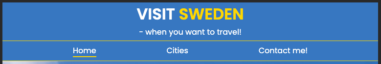

### Home
The starter page on the webpage (index.html) givs the reader some general information about the country Sweden. The user can also read some “fun/interesting” fact about Sweden, and the purpose of that is to get them more interested in the country.  
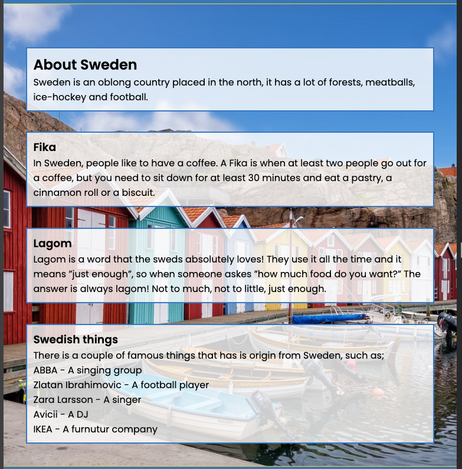

### Cities 
On the cities page the user can see four different cities I Sweden. There is a picture and some short information about the city. 
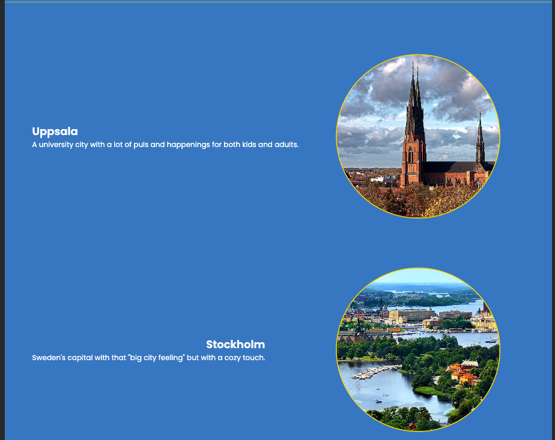
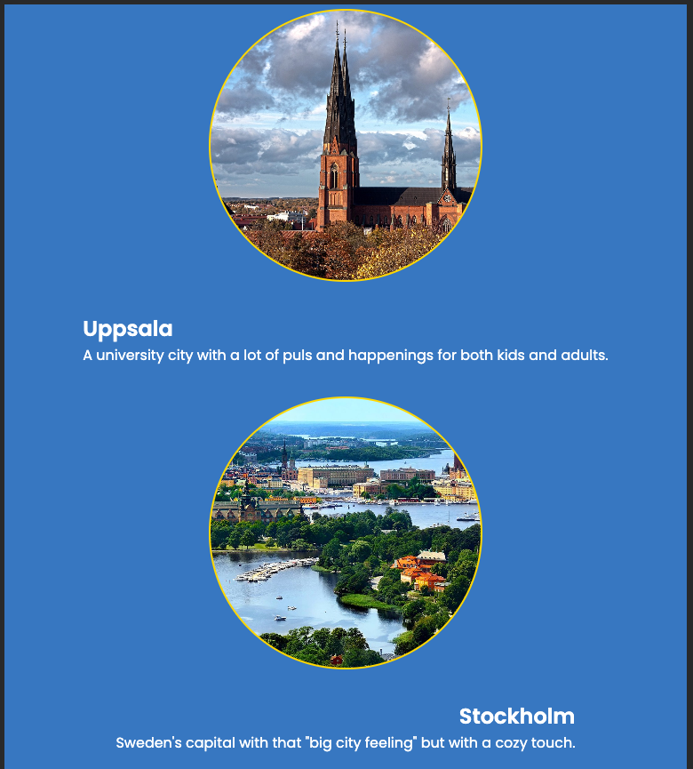
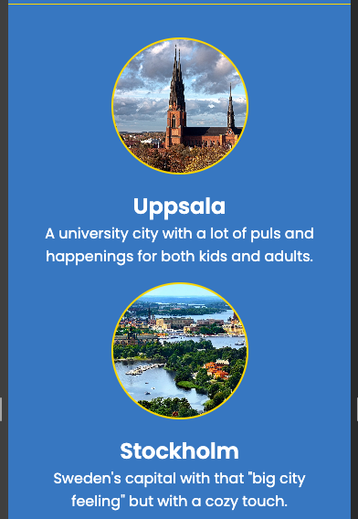

### Contact me!
The form on the “contact me!” page is created so the user can leave some personal information and get help to book a trip to Sweden in return. 
The form collect the users first and last name, the email address, a date for when the user want to make the trip, and a choice of which city they want to visit. 
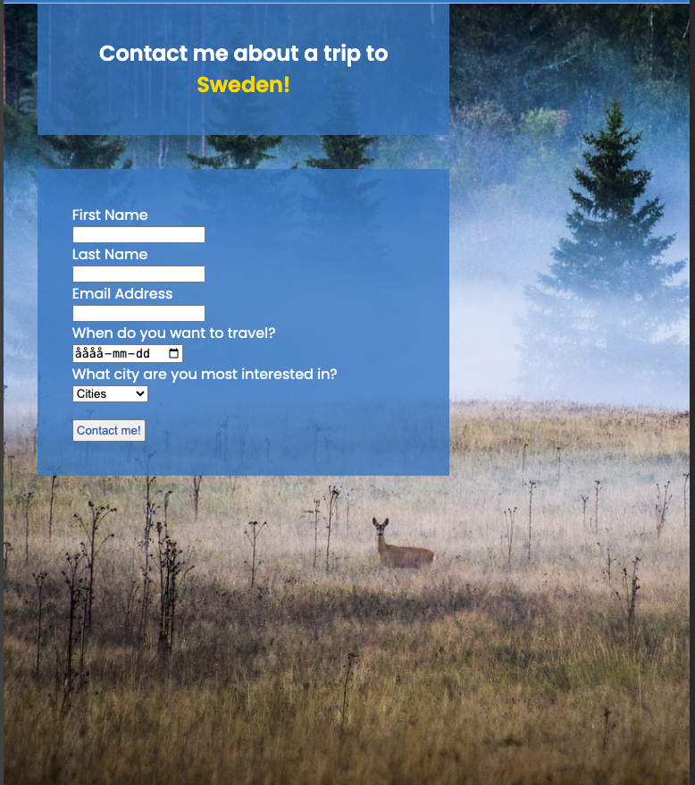

### Footer
The footer has a line of text that encourages the user to have a look at the social medias of the company. And the logos and links to three different social media platforms. The links opens in a new tab. 
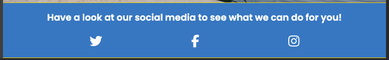

## Testing
### HTML
The link in the logo that takes you back to the home pages works when tested. 
The three links in the Menu (navbar) works form all the pages. 
The three links to the social media platforms in the footer works and opens in new tabs. 
The “contact me” form works when tested. The email area needs to have a proper email address or you cant submit the form. The submission button works and the drop down list shows all four cities. You can´t submi an empty form.   

### UX 
The site has a good contrast between the background and the text.
- All the pages is responsive, from mobil size to laptop size - 320px to 1920px.

## Validator 
## HTML
The HTML code was tested with the W3C validator and no errors was found on any of the three pages. 
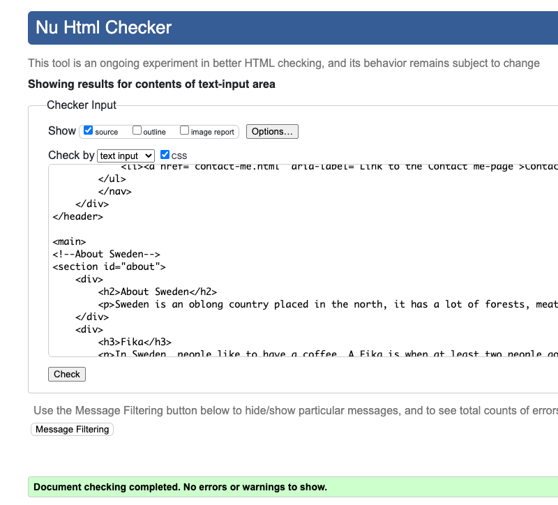
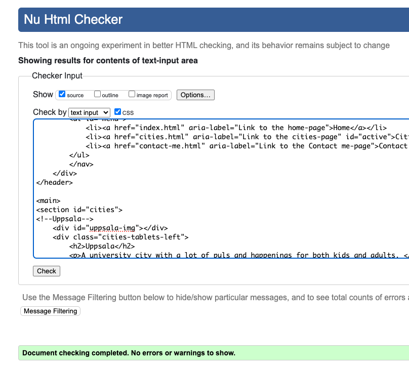
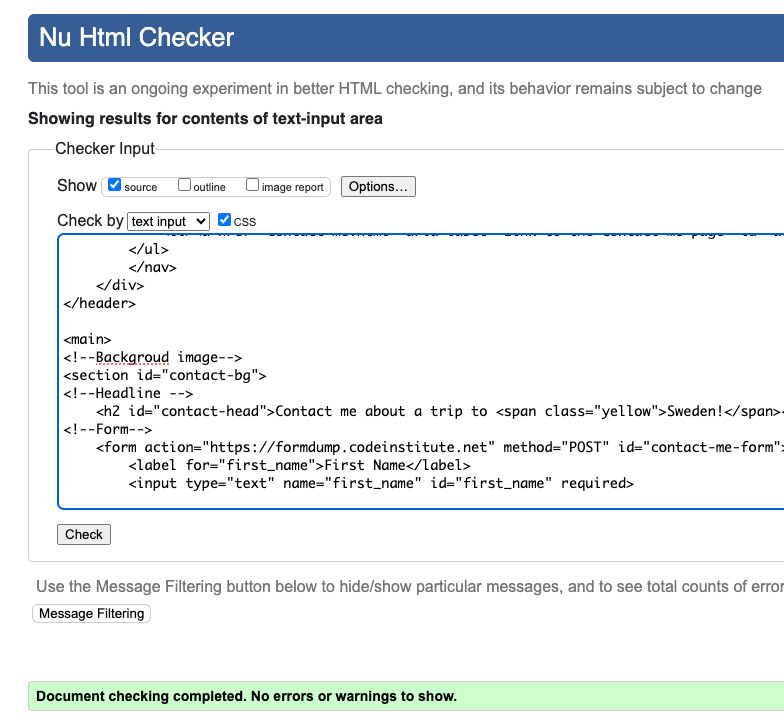

## CSS
The CSS code was tested with the W3C Jigsaw and no errors was found.
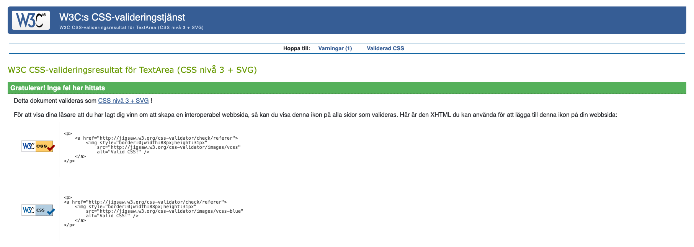

## Lighthouse
Checking the site through Lighthouse, the site hade a bad performance score when it analysed the mobil version. That is because I don’t have the knowledge I need to manage the images properly.  
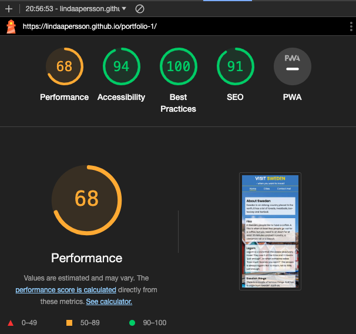

When checking the site through Lighthouse on a desktop version, the score improved.  
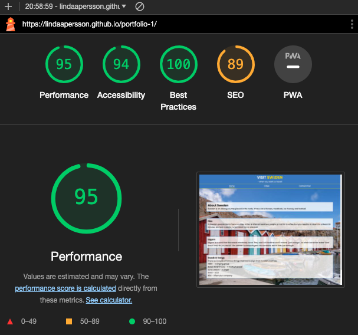

### Deployment
This page was deployed through GitHub Pages through this steps:

1. Log into GitHub.
2. Locate the right GitHub Repository.
3. At the top of the repository, select Settings from the menu.
4. Scroll down the Settings page to the "Pages" section.
5. Under "Source" click the drop-down menu labelled "None" and select "Main".
6. When selected, the page will automatically refresh and the website is deployed.
7. Scroll back down to the "Pages" section to get the link to the webpage.

Here´s the link to the deployed site [Visit Sweden](https://lindaapersson.github.io/portfolio-1/index.html)

Unfixed bugs
- There is no unfixed bugs at the deployed site. 

### Bugs and debuging 
- The link in the logo didn’t work. Solution: Moved the link to the right place in the HTML-code. 
- The id=yellow was used on two different attributs. Solution: changed the ID to a class attribute. 
- W3C validator gave an error on the drop down menu in the form section, becasue it was missing a first choise when loading the page. Solution: Created another <option> with tha value of none.  

## Further development
If I had more time the next step for the page would be to make individual pages for all the cities. So when the user chose a city, the can click on it, get directed to a separate page, and get more information and pictures on the city. 
The site could also benefit from a more advanced and detailed form section, so the user can provide more information to the person that is going to organize the trip. 

## Credits
- The code and images for the favicon is from: [Favicon Generator](https://realfavicongenerator.net)
- The code and links for the footer is from Love Running Project 

## Media 
All background and city images is royalty free from [Pixabay](https://pixabay.com/sv/)
The symbols are from https://fontawesome.com

The screenshots are from: 
[W3C Jigsaw](https://jigsaw.w3.org/css-validator/)
[W3C validator](https://validator.w3.org/)
[Am i responsiv?](https://ui.dev/amiresponsive)
[Visit Sweden](https://lindaapersson.github.io/portfolio-1/index.html)
Lighthouse
