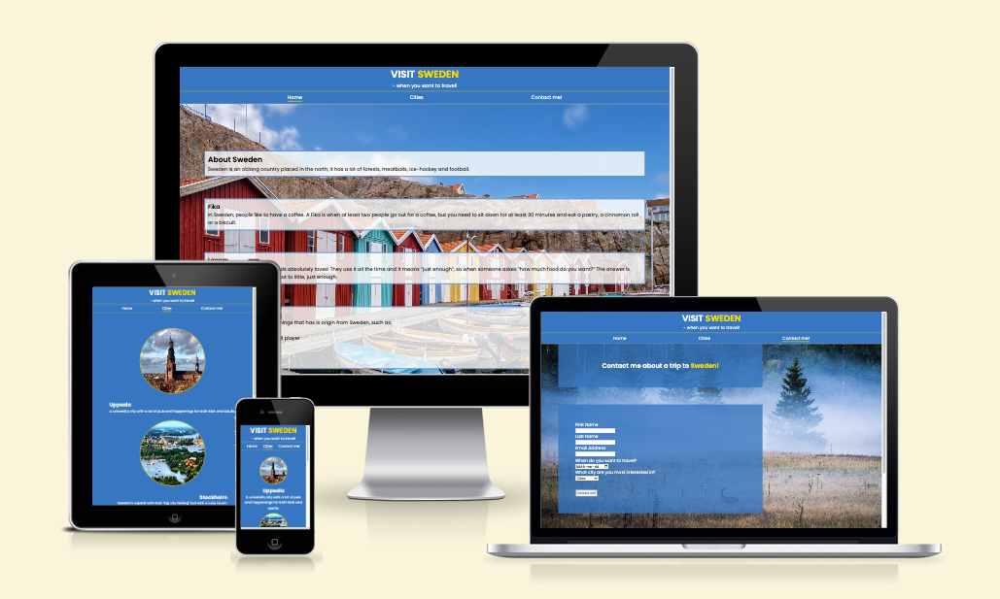

# portfolio-1
# Visit Sweden
The Visit Sweden webpage is for people thinking about taking a trip to Sweden, but want some more information about the country. They can find some generell and fun information about the country and some useful information about a few cities. There is also a form that allows the users to fill in some personal information that will get them help to plan a customized trip.

## Features
### The header
At the top of the webpage there is a header section with a logo, and a navigation/menu underneath. The menu helps the user to navigate to three different sections/pages, home(index), cities and contact-me. 
The logo is yellow on a blue background (to symbol the Swedish flag) 
The navigation is in black in an easy to read font. The color on a white background creates good contrast and visibility. 
The header section of the page clearly tells the user the name of the page, its purpose and where they can find the information. 

Screenshot on header

### Home
The starter page on the webpage (index.html) givs the reader some generell information about the country Sweden. The user can also read some “fun/interesting” fact about Sweden, and the purpose of that is to get them more interested in the country so booking a trip.  
Screenshot on homepage
Cities 
On the cities page the user can see four different cities I Sweden. There is a picture and some short information about the city. 

Screenshot on cities

### Contact me!
The form on the “contact me!” page is created so the user can leave some personal information and get contacted with some help to book a trip to Sweden. 
The form collect the users first and last name, the email address, a date for when the user want to make the trip, and choice of what city the want to visit. 
Screenshot on Contact-me

### Footer
the footer has a line of text ensuring the user to have a look at the social media sites for the company. And the logos and links to three different social media platforms. The links opens in a new tab. 

## Testing
### HTML
The links in the Menu (navbar) works form all the pages. The link in the logo that takes you back to the home site works as well. 
The links to the social media platforms in the footer works and opens in new tabs. 
The “contact me” form works when tested. The email area needs to have a proper email address or you cant submit the form. The submission button works and the drop down list shows all four cities.  

### UX 
The site has a good contrast between the background and the text.
- All the pages is responsive, from mobil size to laptop size.

## Validator 
Using the W3C validator 
HTML, no errors found on any of the three pages. 
CSS, no errors found 
Lighthouse
Checking the site through Lighthouse, the site hade a bad performance score when it analysed the mobil version. That is because don’t have the knowledge I need to manage the images properly.  
BILD

Checking the site through Lighthouse, desktop version, it had a nice score 
BILD

### Deployment
This page was deployed through GitHub Pages

Unfixed bugs
- There is no unfixed bugs. 

### Bugs
- When deploying the link in the logo didn’t work. Solution: Moved the link to the right place in the code. 

## Further development
If I had more time the next step for the page would be to make individual pages for all the cities. So when the user chose a city, the can click on it, get directed to a separate page, and get more information and pictures on the city. 
The site could also benefit from a more advanced and detailed form section, so the user can provide more information to the person that is going to organize the trip. 

## Credits
- The code and images for the favicon is from: https://realfavicongenerator.net
- The code and links for the footer is from Love Running Project 

## Media 
All background and city images is royalty free from Pixabay
The symbols are from https://fontawesome.com

The screenshots are from:

